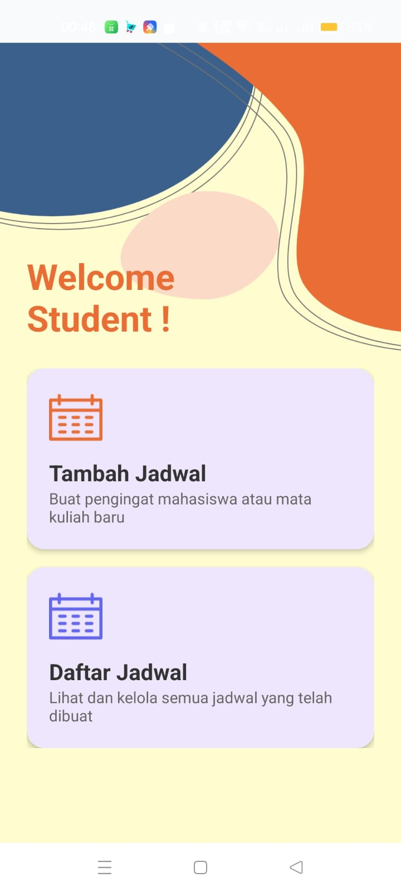
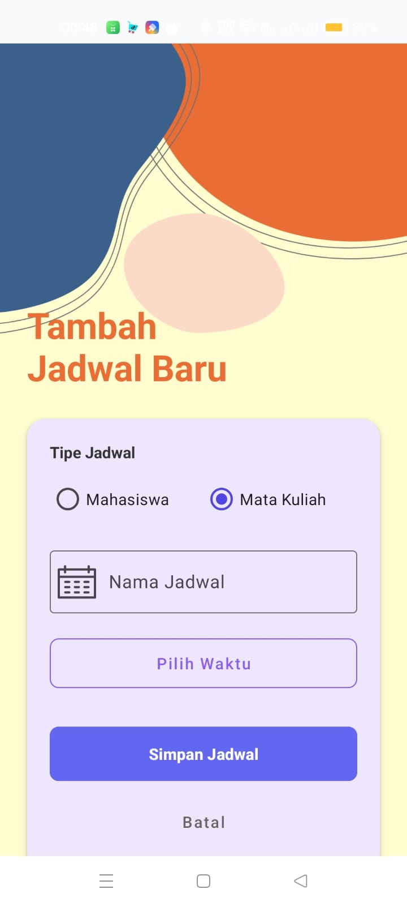
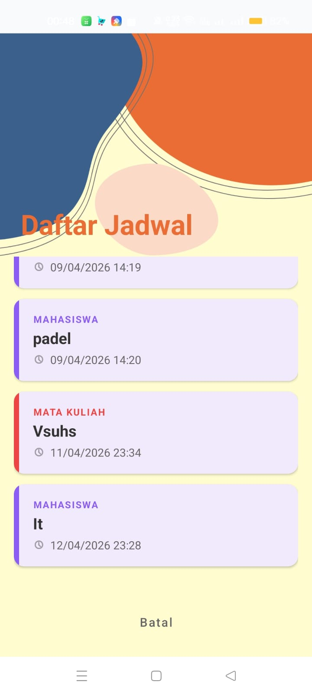

# student-schedule-reminder-app
Android application for managing student schedules and reminder notifications.

# Application Preview

# Overview

Student Schedule Reminder App is an Android application developed to help students organize schedules and receive reminder notifications.

# Features
Add schedules
Manage reminders
Select date and time
Notification system
Local data storage
Technologies
Java
Android Studio
SQLite
AlarmManager
Android SDK

# Author
Silvia

